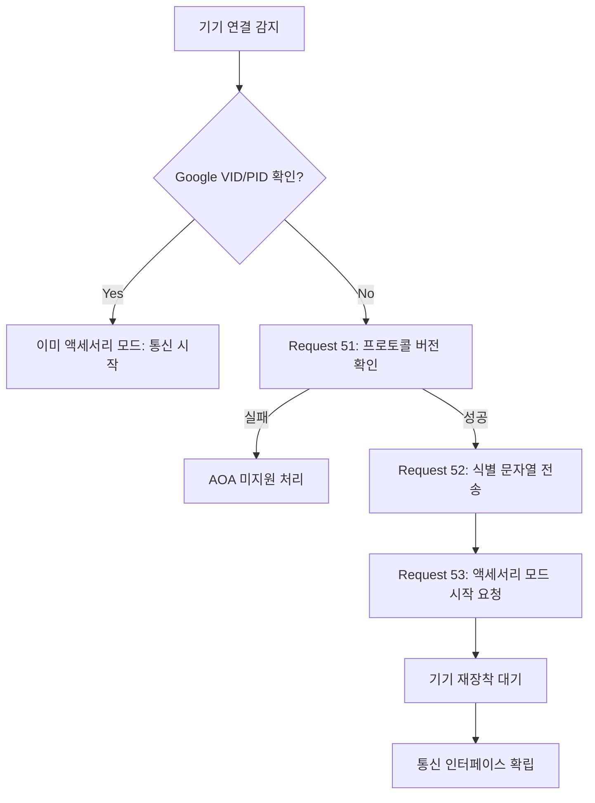

# Android Open Accessory (AOA) 1.0 프로토콜 상세 가이드

이 문서는 Android USB 액세서리가 Android 기기를 감지하고 통신을 설정하기 위해 준수해야 하는 **Android Open Accessory (AOA) 1.0** 프로토콜의 모든 단락을 상세하게 정리한 문서입니다.

---

## 1. 개요 (Overview)

Android USB 액세서리는 AOA 프로토콜을 준수해야 하며, 통신 설정을 위해 다음의 4단계를 수행합니다.

1.  **기기 감지**: 연결된 Android 지원 기기가 있을 때까지 대기 및 감지.
2.  **지원 확인**: 기기의 액세서리 모드 지원 여부 확인.
3.  **모드 시작**: 필요한 경우 기기를 액세서리 모드로 전환 시도.
4.  **통신 설정**: 기기가 AOA를 지원하는 경우 최종 통신 채널 확립.

---

## 2. 기기 감지 (Wait and Detect)

액세서리는 USB 포트에 Android 지원 기기가 연결되는지 지속적으로 확인해야 합니다. 기기가 물리적으로 연결되면 즉시 다음 단계인 지원 확인 절차로 진입합니다.

---

## 3. 액세서리 모드 지원 확인 (Determine Support)

Android 기기가 연결되었을 때, 해당 기기는 다음 세 가지 상태 중 하나일 수 있습니다.

-   **액세서리 모드 활성 상태**: 이미 AOA 모드로 동작 중.
-   **지원하지만 비활성 상태**: 모드 전환이 필요함.
-   **지원하지 않음**: AOA 통신 불가.

### ① USB 디바이스 설명자 확인
처음 연결 시 액세서리는 기기의 USB 설명자(Descriptor)를 확인합니다.
-   **공급업체 ID (VID)**: `0x18D1` (Google 공급업체 ID와 일치해야 함)
-   **제품 ID (PID)**:
    -   `0x2D00`: 액세서리 모드 전용.
    -   `0x2D01`: 액세서리 모드 + ADB (디버깅용 인터페이스 포함).

기기가 이미 위 PID를 보고하고 있다면 액세서리 모드에 있는 것이므로, 즉시 대량 전송(Bulk) 엔드포인트를 통해 통신을 시작할 수 있습니다.

> [!NOTE]
> **디버그 고려사항**: 0x2D01은 ADB 프로토콜을 위한 추가 인터페이스를 노출합니다. 액세서리가 ADB 패스스루를 구현하지 않는 한 일반적으로 첫 번째 인터페이스만 사용합니다.

### ② 예외 사항 및 주의사항
-   VID/PID가 예상값과 다르면 기기가 액세서리 모드를 지원하는지 알 수 없으므로, **"액세서리 모드 시작 시도"** 절차를 반드시 거쳐야 합니다.
-   **중요**: 초기 핸드셰이크 시 헤더(제조업체, 모델, 버전)를 보내야 합니다. 특히 Android 10 이하 기기에서 버전 정보를 기대하는 앱이 설치되어 있으나 액세서리가 버전을 보내지 않으면 시스템 예외로 기기가 **재부팅**될 수 있습니다.

---

## 4. 액세서리 모드에서 시작 시도 (Attempt to Start)

기기가 초기 상태에서 일반적인 제조사 PID를 보고한다면, 액세서리는 수동으로 모드 전환 명령을 보내야 합니다.

### 1단계: 프로토콜 버전 확인 (Request 51)
기기에 51번 제어 요청을 보내 AOA 프로토콜 지원 여부와 버전 번호를 확인합니다.
-   **Request Type**: `USB_DIR_IN | USB_TYPE_VENDOR`
-   **Request**: `51`
-   **Data**: 16비트 프로토콜 버전 번호 (Little Endian). 0이 아닌 값이 오면 지원함을 의미합니다.

### 2단계: 식별 문자열 전송 (Request 52)
기기가 적절한 앱을 결정하거나 정보를 표시할 수 있도록 액세서리 정보를 전송합니다.
-   **Request Type**: `USB_DIR_OUT | USB_TYPE_VENDOR`
-   **Request**: `52`
-   **Index**: 문자열 ID (0~5)
-   **Data**: Null로 끝나는 UTF-8 문자열 (최대 256바이트)

| 문자열 ID | 설명 | 항목 |
| :--- | :--- | :--- |
| 0 | Manufacturer | 제조업체 이름 |
| 1 | Model | 모델 이름 |
| 2 | Description | 설명 |
| 3 | Version | 버전 |
| 4 | URI | 관련 URL (앱 미설치 시 안내용) |
| 5 | Serial Number | 일련번호 |

### 3단계: 액세서리 모드 시작 요청 (Request 53)
기기에 실제 모드 전환을 지시합니다.
-   **Request Type**: `USB_DIR_OUT | USB_TYPE_VENDOR`
-   **Request**: `53`
-   **Action**: 이 요청을 받은 기기는 USB 버스에서 연결을 끊었다가 Google VID/PID로 다시 장착(Re-enumerate)됩니다.

> [!WARNING]
> **MTP 충돌**: 현재 AOA는 MTP(미디어 전송 프로토콜)와 동시에 연결될 수 없습니다. 전환이 필요할 경우 장치를 물리적/전기적으로 분리한 후 다시 연결해야 합니다.

---

## 5. 기기와의 통신 설정 (Establish Communication)

기기가 액세서리 모드로 다시 열거(Re-enumeration)되면, 액세서리는 최종 엔드포인트를 찾아 연결을 확립합니다.

### ① 인터페이스 및 엔드포인트 쿼리
제품 ID(PID)에 따라 구성이 달라집니다.

-   **PID 0x2D00 (Accessory Only)**:
    -   1개의 인터페이스.
    -   2개의 대량(Bulk) 엔드포인트 (IN 1개, OUT 1개).
-   **PID 0x2D01 (Accessory + ADB)**:
    -   2개의 인터페이스.
    -   첫 번째 인터페이스: 표준 액세서리 통신 채널.
    -   두 번째 인터페이스: ADB 통신 채널.

### ② 최종 구성 (Set Configuration)
1.  기기의 인터페이스 설명자를 탐색하여 첫 번째 대량 입출력 엔드포인트를 찾습니다.
2.  `SET_CONFIGURATION` (0x09) 요청을 통해 기기 설정 값을 **1**로 지정합니다.
3.  이제 해당 엔드포인트를 통해 데이터를 주고받을 수 있습니다.

---

## 요약 프로세스 다이어그램

